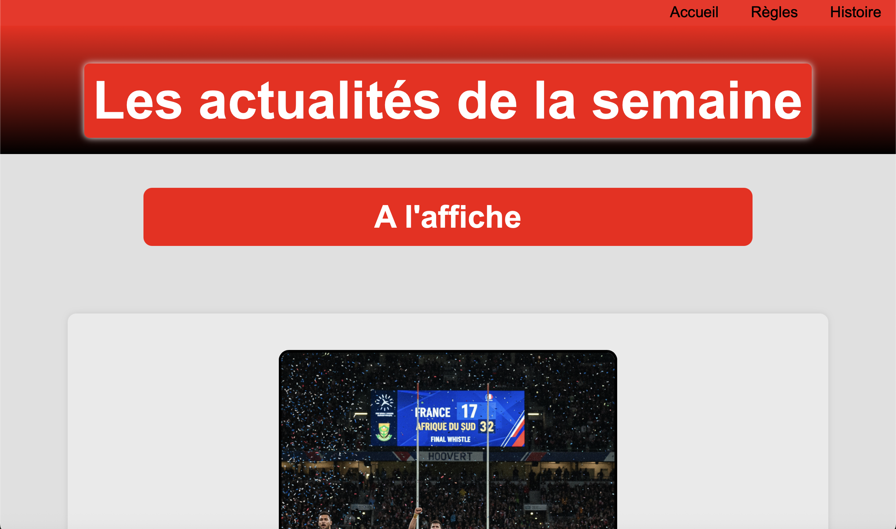
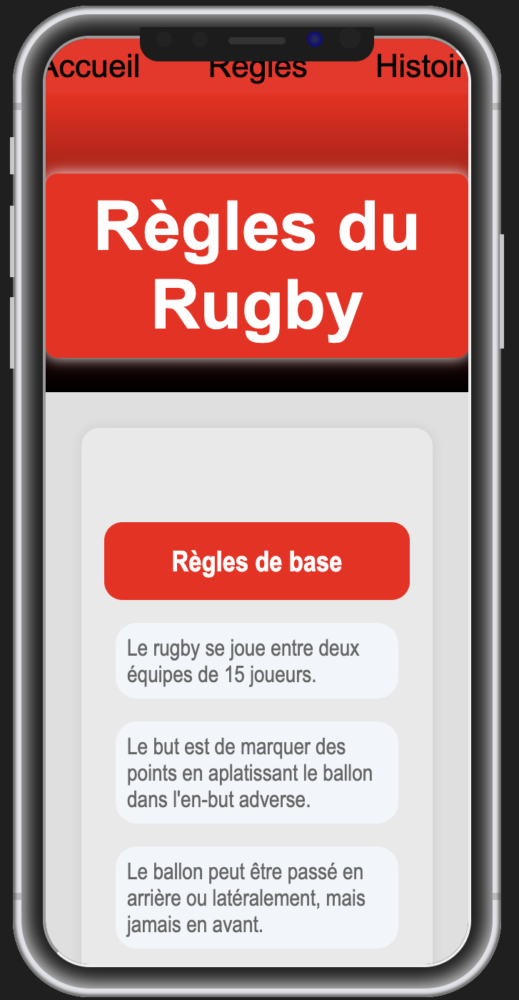

### SAE 14 : HTML - CSS

### Lien vers le site : https://iban18.github.io/rugby-site1/

## Visuel de la page 

|  |  |
|:---:|:---:|
|  |  |
|  |  |

## Vue Mobile 

|  |  |
|:---:|:---:|
|  |  |
|  |  |

## Animation du site 

https://github.com/user-attachments/assets/4716671f-2c12-4449-8ae6-d77f3be897c6

## Validations : 

# W3C:HTML 

# W3C:CSS

# WAVE 

# WCAG.0AA

