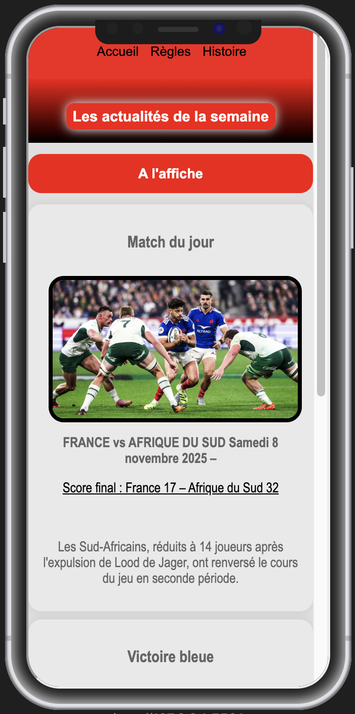
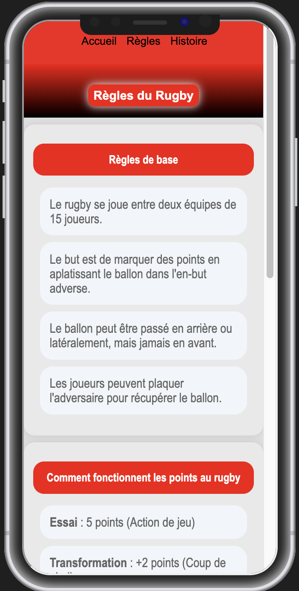
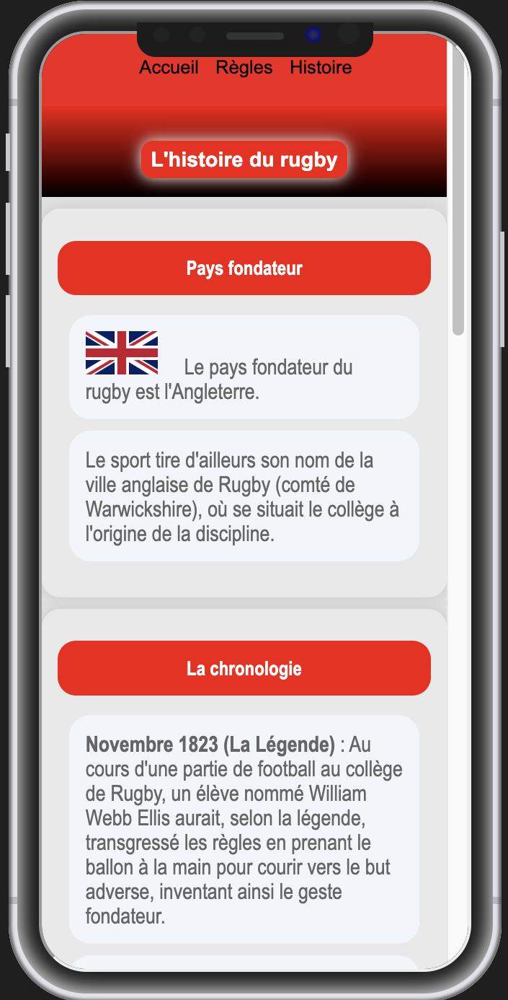
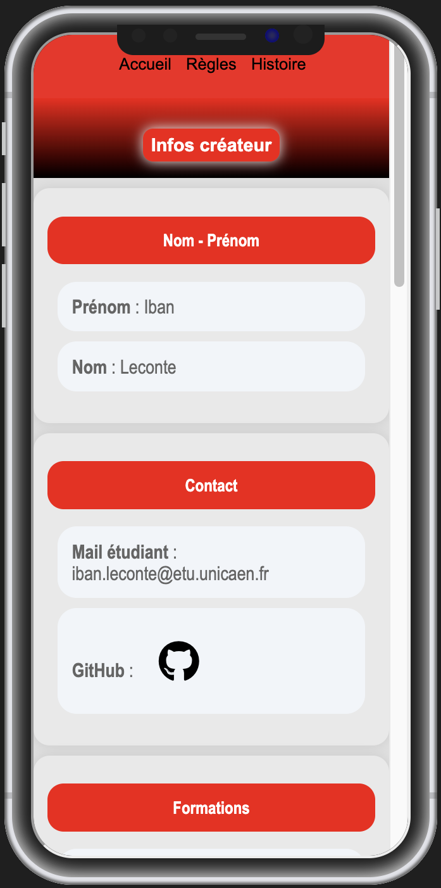
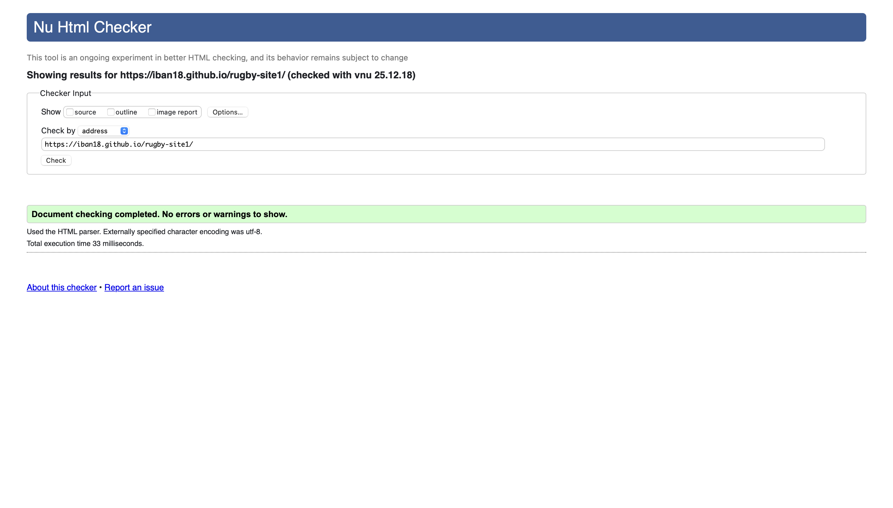
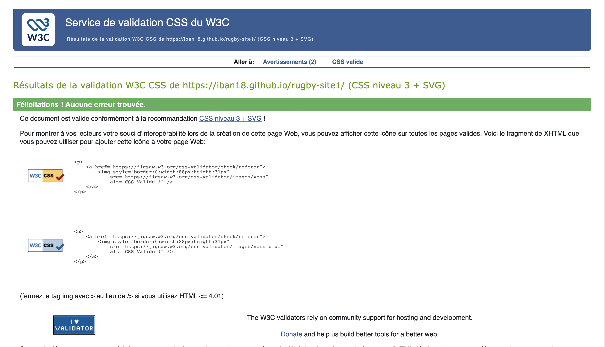
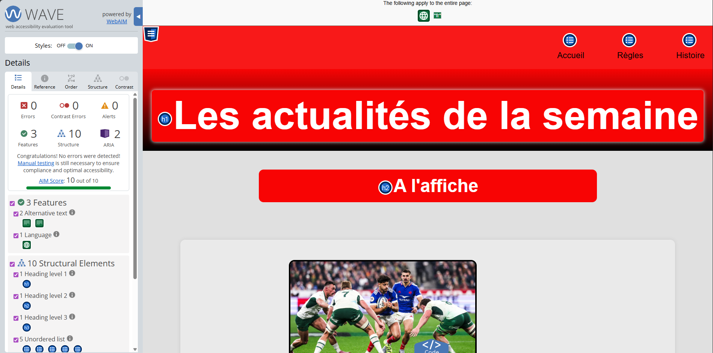
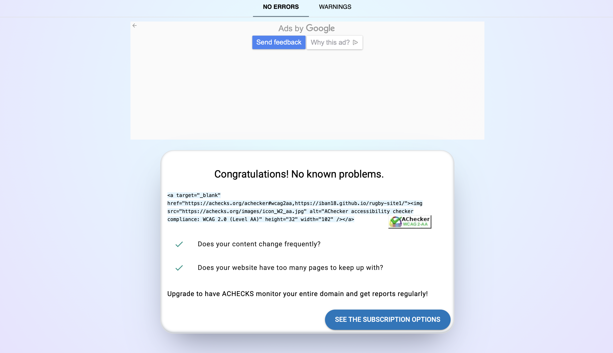

### SAE 14 : HTML - CSS

### Lien vers le site : https://iban18.github.io/rugby-site1/

## Visuel de la page 

|  |  |
|:---:|:---:|
|  |  |
|  |  |

## Vue Mobile  

|  |  |
|:---:|:---:|
|  |  |
|  |  |

## Animation du site 

https://github.com/user-attachments/assets/4716671f-2c12-4449-8ae6-d77f3be897c6

## Cahier des charges : 

### ___Pages :___

✅ Page d'accueil 

✅ Page dédiée au sujet 

✅ Page "À propos" avec mes informations

### ___Charte graphique :___

✅ Couleur dominante rouge #f80404(rouge)

✅ Navigation navbar identique 

✅ Structure de contenu uniforme 

✅ Typographie cohérente 

### ___Validation W3C & WCAG 2.0 AA :___

✅ W3C HTML : Validation réussie 

✅ W3C CSS : Validation réussie 

✅ WAVE : Tests d'accessibilité passés

✅ WCAG 2.0 AA : Conformité certifiée 

### ___Flexbox & CSS Grid :___

✅ Flexbox utilisé 

✅ Responsive 

### ___Animations CSS :___

✅ Swipe au chargement 

✅ Hover sur images 

✅ Hover sur liens 

### ___GitHub & Déploiement :___

✅ Repository : https://github.com/iban18/rugby-site1

✅ GitHub Pages : https://iban18.github.io/rugby-site1/ 

### ___Commits significatifs :___

✅ "dernier changement dans le readme et ajout des livrables"

✅ "responsive reglage"

✅ "w3c"

✅ "ajout de la nouvelle video"

✅ "amélioration du responsive"

### ___README.md détaillé :___
✅ Titre du projet "SAE 14 : HTML - CSS"

✅ Lien vers l'hébergement Pages

✅ Visuels du site (4 screenshots desktop)

✅ Visuels mobiles (4 screenshots)

✅ Preuves de validation W3C, WCAG

✅ Vidéo de démonstration des animations

## Validations : 

# W3C: HTML
 

# W3C: CSS

 

# WAVE 

 

# WCAG.0AA

 

